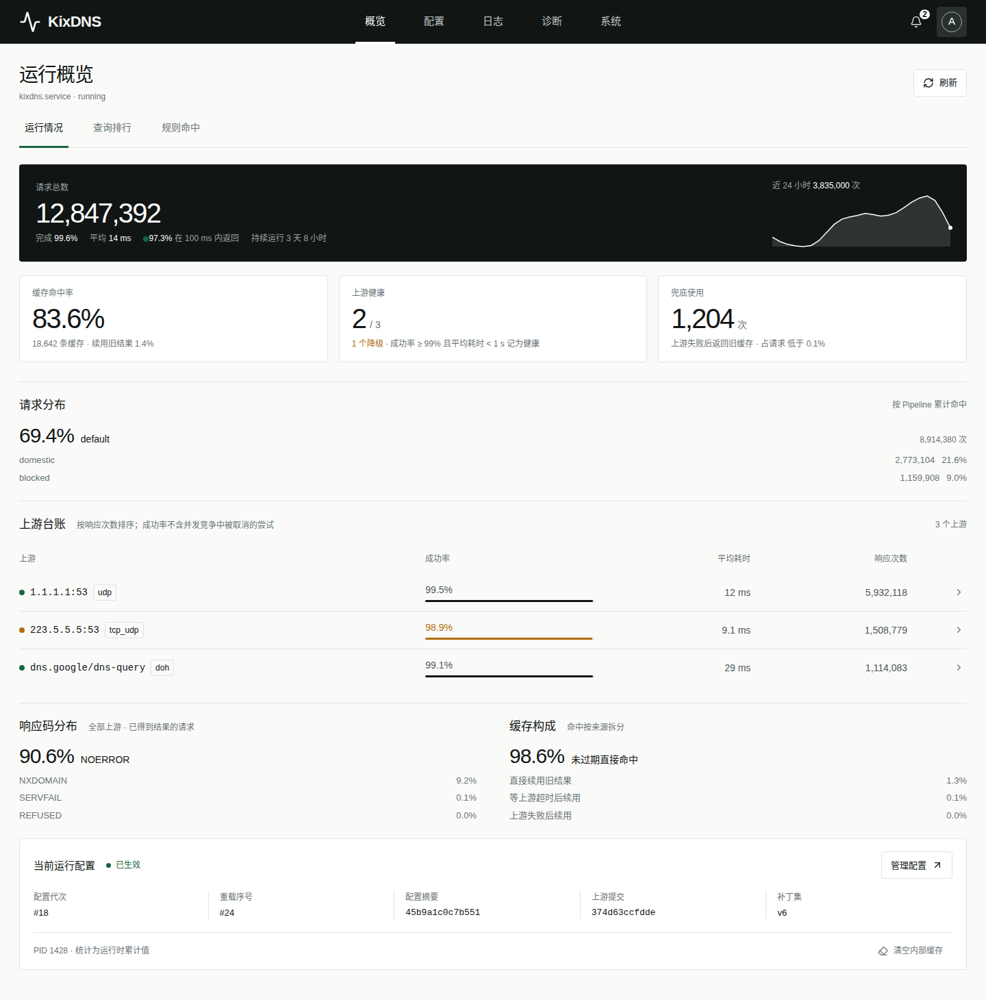
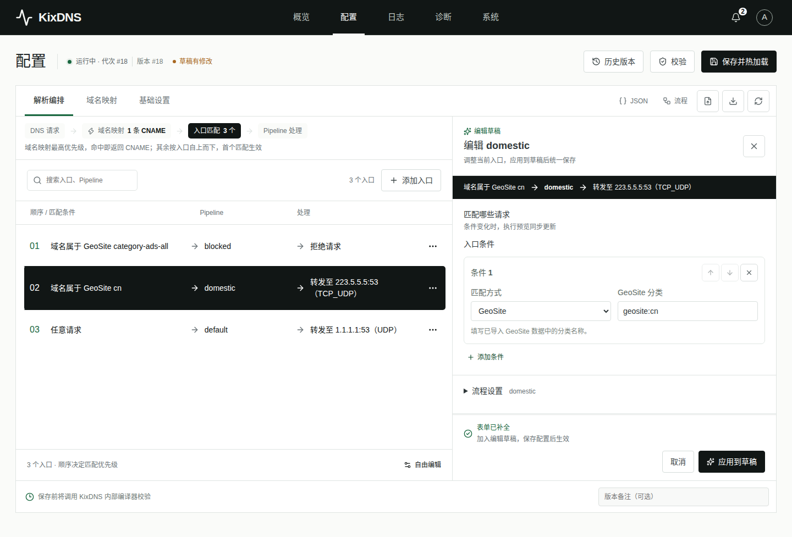
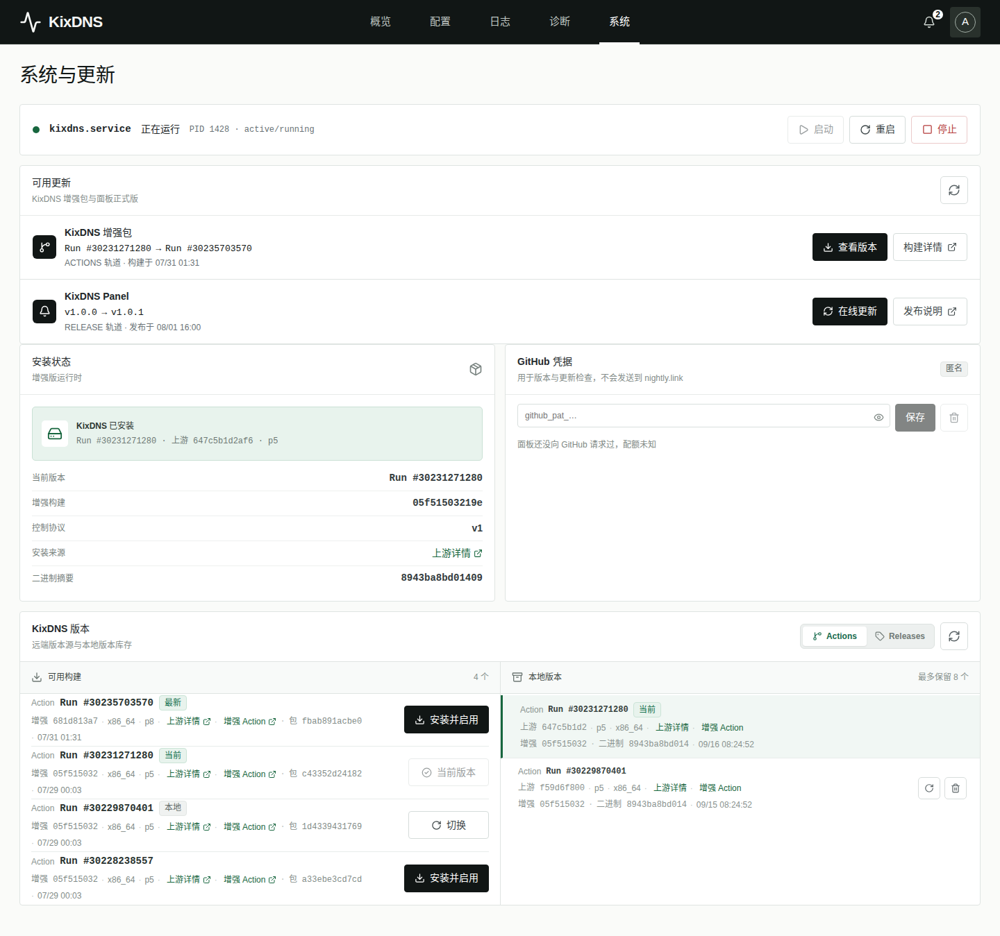
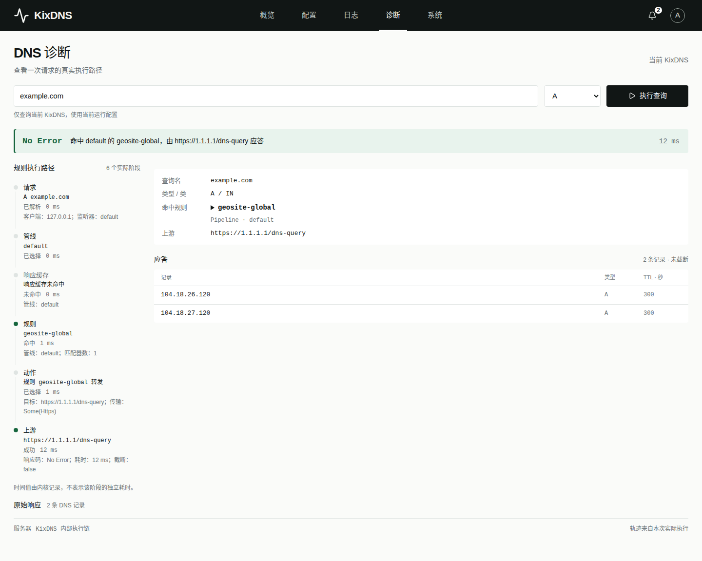

# KixDNS Panel

KixDNS 的非 Fork 增强发行版与管理面板。项目维护上游正式 Release 与 `main` 分支成功 Action 的已验证版本目录，不保存上游源码副本；增强能力以可重放补丁维护，管理端通过稳定的本机协议与数据面解耦。

## 界面预览

| 运行概览 | 配置管理 |
| :--: | :--: |
|  |  |

| 系统与更新 | DNS 诊断 |
| :--: | :--: |
|  |  |

*截图来自本地演示环境，运行指标、构建版本与查询结果均为示例数据。*

## 已实现能力

- KixDNS 内部请求、并发、缓存、Pipeline、规则和上游指标
- 带代次、SHA-256、重载序号与错误信息的结构化热加载回执
- Argon2id 管理员认证、HttpOnly 会话、CSRF 防护和登录限流
- 与上游编辑器功能对齐的结构化表单、原始 JSON、流程预览及导入导出
- GeoIP/GeoSite HTTPS 链接下载、内容摘要托管与本地路径兼容模式
- KixDNS 编译校验、乐观锁保存、版本历史、回滚和失败自动恢复
- 配置字段能力门控、后端强制校验与版本切换前兼容预检
- 面板内安装 KixDNS、切换 Releases/Actions 版本源并回切本地版本
- systemd 启动、停止、重启固定动作控制，journal 日志与自动跟随当前监听端口的本机 DNS 诊断
- 首次安装默认保持 KixDNS 停止；面板启停同步开机策略，宿主机重启后保持用户选择
- KixDNS 停止时保留最后一次概览和查询排行快照，并明确标记数据已停止更新
- 系统页一键在线更新面板正式版，校验双层摘要且不替换或启停 KixDNS
- 上游 Releases/Actions 都由本仓库 Action 生成增强 Artifact，并通过 nightly.link 匿名下载
- 系统页可选配置 GitHub Token，将元数据 API 配额从匿名 60 次/小时提升到认证配额；Token 不会发送到 nightly.link
- 版本激活健康检查、失败自动恢复与最多 8 个本地版本的受控库存
- Vue 3 响应式控制台，桌面侧栏与移动端底部导航
- 面板与两条增强内核轨道独立构建 x86_64/ARM64 Artifact，自动跟随并续期已验证上游
- 发布前真实启动增强进程，验证 DNS 应答、内部指标与结构化热加载回执
- 完整包在 Ubuntu 22.04 临时机执行安装、覆盖升级、面板联调、systemd 控制与卸载验收

## 架构

```text
Browser -> Panel Web -> Panel Server -> SQLite / 配置 / systemd
                              |
                              v
                    /run/kixdns/admin.sock
                              |
                              v
                       KixDNS Enhanced
```

上游源码仅在构建目录中检出。[upstream.lock.json](upstream.lock.json) 与 [upstream.release.lock.json](upstream.release.lock.json) 指向两条轨道的当前版本，[upstreams](upstreams) 保存可切换目录；`cargo xtask prepare --lock <文件>` 按锁中的编号应用 [不可变补丁集](patches)。面板服务不导入上游 crate，只依赖[增强控制协议 v1](docs/control-protocol-v1.md)。

### 版本轨道示例

| 面板版本源 | 上游身份 | 增强工作流 | x86_64 Artifact |
| --- | --- | --- | --- |
| Actions | 官方 Run `#30912075286`，提交 `e55f0a858053` | `build-kixdns.yml` | `kixdns-enhanced-action-30912075286-p9-c4f5a139e71b-linux-x86_64` |
| Releases | 正式版 `v0.1.1`，提交 `647c5b1d2af6` | `build-kixdns-release.yml` | `kixdns-enhanced-release-v0.1.1-p9-ff2ab98809cd-linux-x86_64` |

两种 KixDNS 增强包都来自本仓库 Actions，并通过 nightly.link 下载；这里的 `Releases` 只表示数据面源码基线来自 `olicesx/kixdns` 正式发布，与本面板自身的 Release 相互独立。Action 目录当前包含 4 个已验证版本，之后自动追加并滚动保留最多 10 个；Release 从增强协议基线 `v0.1.1` 起只追加、不设数量上限。`v0.1.0` 的核心架构早于增强协议，不能安全套用当前补丁，因此不会伪装成可安装增强包。

包名中的补丁集和输入指纹由上游锁、该锁选择的不可变补丁集、构建工具与 Rust 工具链共同生成。适配新 API 时新增补丁集并只切换新候选锁，旧版本继续使用原补丁集且不会重新编译；普通面板代码或文档提交同样不会触发 KixDNS 构建。本地库存使用 `来源 + Artifact ID + 构建提交` 区分同一工作流批量生成的版本。

## 快速开始

官方 GNU 安装包要求 GLIBC 2.35 或更高版本，支持 Ubuntu 22.04、Debian 12 及更新发行版的 x86_64/ARM64 系统。

推荐使用一键安装命令。脚本会读取最新正式 Release，校验 GitHub 提供的 SHA-256 摘要，再进入下面的交互式安装流程：

```bash
curl -fsSL https://raw.githubusercontent.com/tuoro/kixdns-panel/main/scripts/one-click-install.sh | sudo bash
```

也可以固定安装某个正式版本：

```bash
curl -fsSL https://raw.githubusercontent.com/tuoro/kixdns-panel/main/scripts/one-click-install.sh \
  | sudo bash -s -- --version v1.0.17
```

稳定版从面板 GitHub Release 下载；`main` 分支的 Action 仅用于持续验证和开发包构建：

```bash
# x86_64；ARM64 将文件名中的 x86_64 改为 arm64
curl -fL -o kixdns-panel.zip \
  https://github.com/tuoro/kixdns-panel/releases/download/v1.0.17/kixdns-panel-linux-x86_64.zip
mkdir kixdns-panel && unzip kixdns-panel.zip -d kixdns-panel
cd kixdns-panel
sudo bash ./scripts/install.sh
```

如果主机已经存在 KixDNS，安装器会让你选择保留现有安装或迁移为 KixDNS Enhanced，不会默认替换。无人值守安装请显式使用 `--keep-existing` 或 `--replace-existing`；保留模式只接入受限面板，迁移模式会备份原 systemd unit 并保留原配置路径。

面板 `v1.0.17` Release 提供 `kixdns-panel-linux-x86_64.zip` 与 `kixdns-panel-linux-arm64.zip`。正式包记录 Release 标签，面板只根据后续正式 Release 提示自身更新；普通 `main` 提交和临时 Action 包不会触发面板更新提示。发现新版后可在“系统”页直接在线更新，过程固定从 `tuoro/kixdns-panel` 最新正式 Release 下载当前架构包，并校验 GitHub 资产摘要与包内 `SHA256SUMS`；更新只替换 Panel Server、Web、helper 和部署脚本，KixDNS 二进制、配置及启停状态保持不变。

公共仓库无需 Token 也能使用，但 GitHub 匿名 API 仅提供每个出口 IP 60 次/小时。若同一公网 IP 下有多台设备，建议在“系统”页配置只读的 Fine-grained PAT；面板先通过 GitHub `/rate_limit` 验证，再以 `0600` 保存到 `/var/lib/kixdns-panel/github-token`。接口只返回是否配置和剩余配额，不返回 Token 明文或片段；删除后立即恢复匿名模式。

安装后面板监听 `0.0.0.0:5738`，安装器会探测默认路由对应的内网 IPv4，并输出形如 `http://192.168.1.20:5738` 的访问链接。首次受管安装不会自动启动 KixDNS，可在“系统”页启动；尚未产生运行快照时概览仍保留与运行状态相同的完整面板布局，以零值和 `--` 展示尚无数据的指标，同时明确标记未启动且禁用运行时操作。面板启动会同步启用开机启动，停止会同步禁用，因此宿主机重启后保持最后选择的状态；已有运行快照的停止状态仍会显示最后一次数据。首次访问创建管理员；请勿把 HTTP 端口直接映射到公网，跨不可信网络访问应限制防火墙来源，并使用 HTTPS 反向代理与 Secure Cookie。登录后可在“系统”页安装或切换受管 KixDNS 构建，并控制服务启动、停止和重启。增强版本之间切换不重复弹窗，失败会自动恢复；从外部安装迁移到增强版必须重新运行安装器并明确选择迁移。KixDNS 没有独立的服务重载动作，因此面板不提供重载按钮或 API；配置保存后的文件监听热加载是另一条独立链路。完整步骤、权限模型、版本管理与卸载见[部署指南](docs/deployment.md)。

安装完成后可以直接使用全局卸载命令：

```bash
sudo kixdns-panel-uninstall
```

卸载器会依次询问是否保留 KixDNS，以及是否保留面板配置、数据库、版本库和 Geo 数据。没有本地卸载命令时，也可以使用 `curl -fsSL https://raw.githubusercontent.com/tuoro/kixdns-panel/main/scripts/uninstall.sh | sudo bash`。

## 本地开发

```bash
cargo test --workspace --locked
cd web
npm ci
npm test
npm run dev
```

前端演示数据模式：

```bash
VITE_DEMO_MODE=true npm run dev
```

更多设计细节见[系统架构](docs/architecture.md)，字段兼容规则见[配置能力契约](docs/config-capabilities.md)，补丁维护方法见[补丁说明](patches/README.md)。本项目采用 GPL-3.0-only 许可证。
