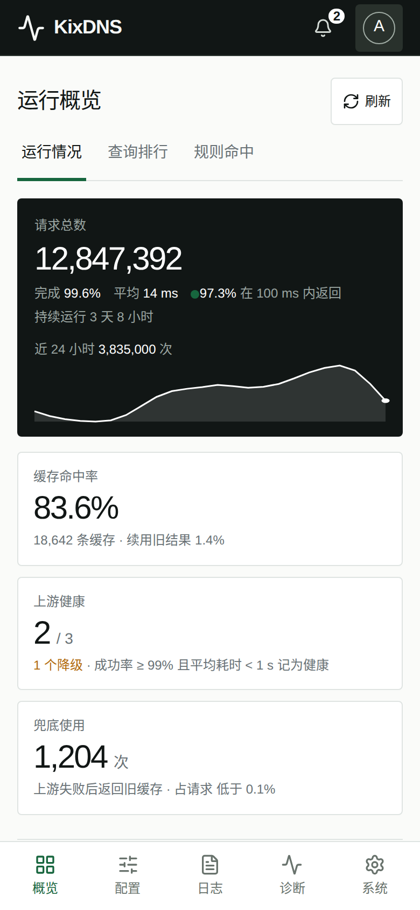
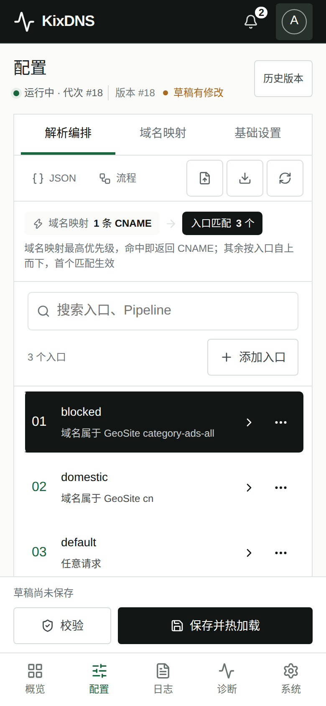

# KixDNS Panel

[KixDNS](https://github.com/olicesx/kixdns) 的增强发行版与 Web 管理面板。上游源码不进本仓库，增强能力以可重放补丁维护；面板只通过本机控制协议与 DNS 数据面通信。

## 界面预览

| 运行概览 | 配置管理 |
| :--: | :--: |
|  |  |

| 系统与更新 | DNS 诊断 |
| :--: | :--: |
|  |  |

*截图来自本地演示环境，数据均为示例。*

<details>
<summary>移动端预览</summary>

<p>
  
  
</p>

</details>

## 能做什么

- **运行概览**：请求量、完成率、耗时、请求量趋势、缓存命中、上游健康、Pipeline 与规则命中、查询排行
- **配置管理**：结构化表单与原始 JSON 双向编辑，域名映射、GeoIP/GeoSite 数据托管；保存前由 KixDNS 自身校验，热加载失败自动回滚，保留版本历史
- **DNS 诊断**：对本机 KixDNS 发起查询，逐段展示命中的 Pipeline、规则、缓存与上游
- **日志**：KixDNS journal 实时查看与操作审计
- **版本管理**：在面板内安装、切换 KixDNS 增强版（跟随上游 Action 或正式 Release），激活失败自动恢复
- **面板自更新**：系统页一键更新到最新正式版，双重校验摘要，不动 KixDNS
- **安全**：Argon2id 认证、HttpOnly 会话、CSRF 防护、登录限流；面板进程不以 root 运行
- 桌面与手机均可用

## 安装

需要带 systemd 的 Linux x86_64/ARM64，GLIBC 2.35 及以上（Ubuntu 22.04、Debian 12 或更新）。一键安装另需 `curl`、`jq`、`unzip`。

```bash
curl -fsSL https://raw.githubusercontent.com/tuoro/kixdns-panel/main/scripts/one-click-install.sh | sudo bash
```

装完访问安装器输出的地址（默认端口 `5738`），首次访问创建管理员。KixDNS 默认不自动启动，在「系统与更新」页启动即可。

主机上已有 KixDNS 时，安装器会说明迁移会做什么，并在你同意后迁移为增强版：配置和运行状态保留，卸载面板时可恢复原来的 KixDNS；不同意则什么都不改。**不要把 `5738` 直接暴露到公网**，跨网络访问请走 HTTPS 反向代理。

固定版本安装、手动安装、反向代理、权限模型和卸载见[部署指南](docs/deployment.md)。每个版本的变化见 [Releases](https://github.com/tuoro/kixdns-panel/releases)。

卸载：

```bash
sudo kixdns-panel-uninstall
```

## 开发

```bash
cargo test --workspace --locked
cd web && npm ci && npm test
VITE_DEMO_MODE=true npm run dev   # 演示数据模式
```

## 文档

- [部署指南](docs/deployment.md)：安装、权限、版本管理、运维与卸载
- [系统架构](docs/architecture.md)：组件边界、构建流水线与安全设计
- [增强控制协议 v1](docs/control-protocol-v1.md)：面板与 KixDNS 之间的本机接口
- [配置能力契约](docs/config-capabilities.md)：新配置字段的兼容规则
- [补丁说明](patches/README.md)：补丁集维护与上游重基

许可证：GPL-3.0-only。
